# SIMPLE TO-DO APPLICATION ON MERN WEB STACK #

## STEP 1 – BACKEND CONFIGURATION ##

### Update ubuntu ###
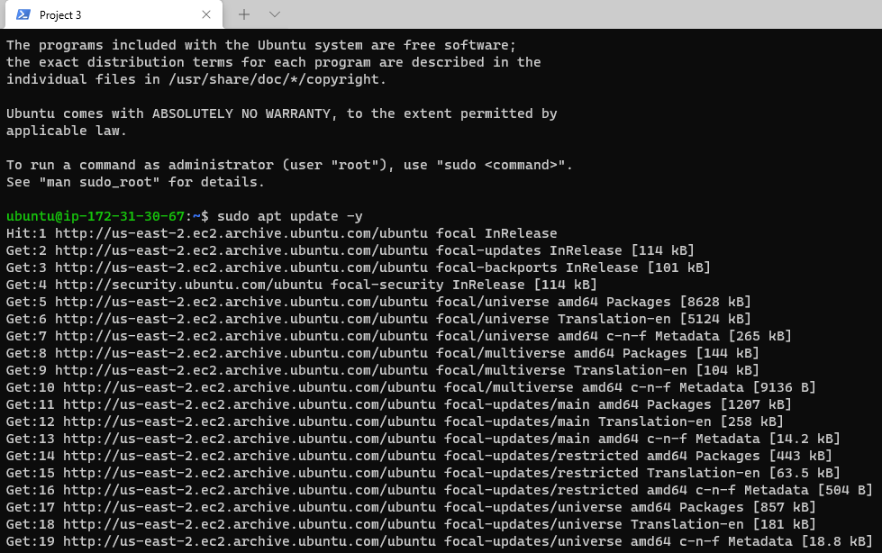

### Upgrade ubuntu ###
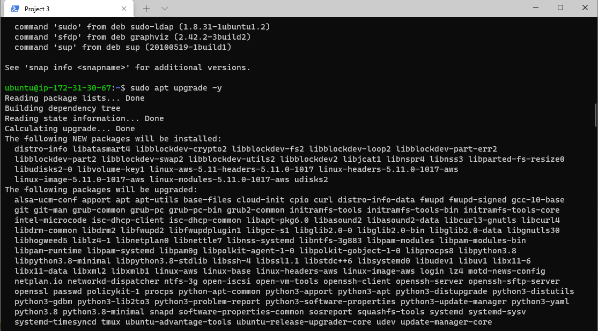

### Lets get the location of Node.js software from Ubuntu repositories ###
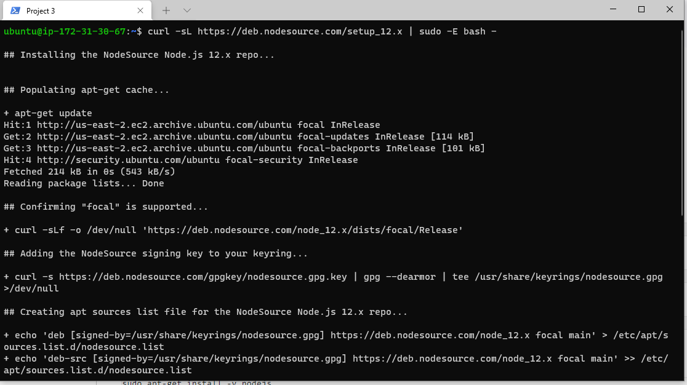

### Install Node.js on the server ###

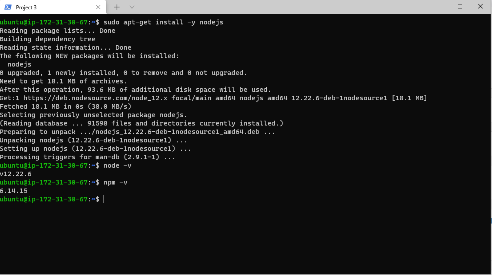

## Application Code Setup ##

### Create a new directory for your To-Do project: ###

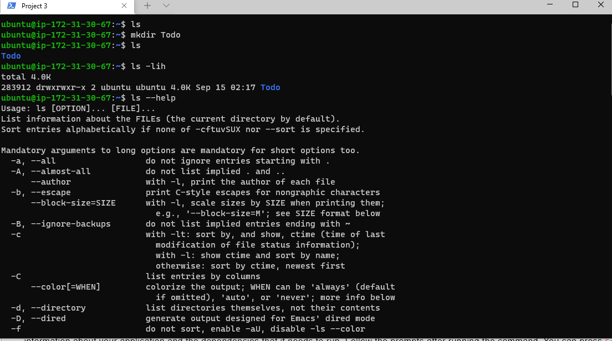

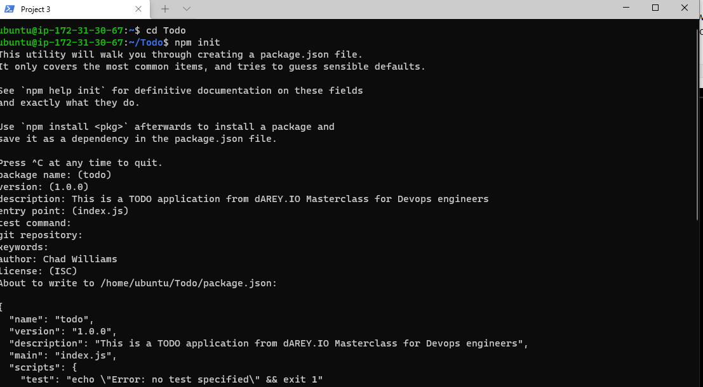
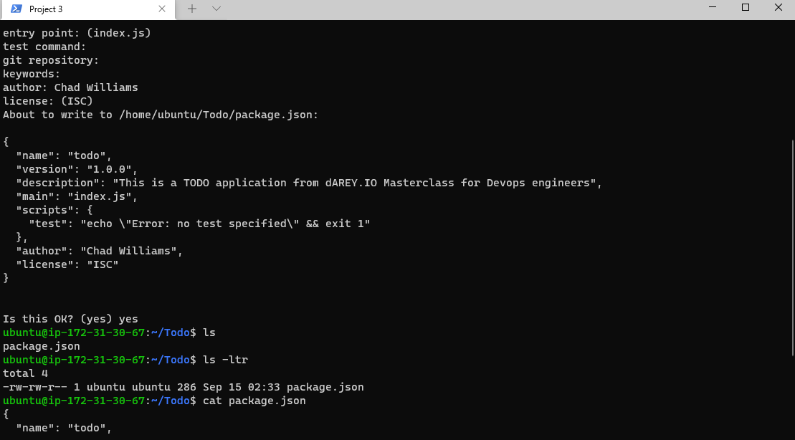

## INSTALL EXPRESSJS ##
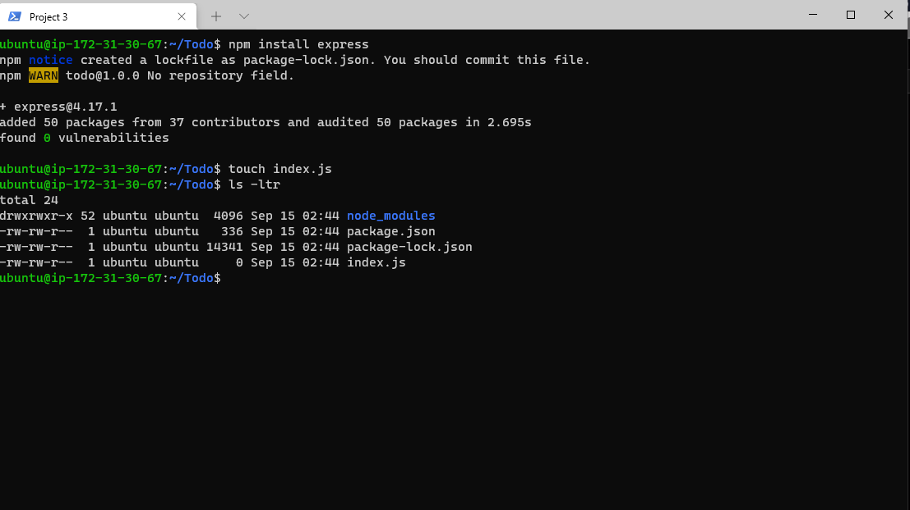

## Install the dotenv module ##
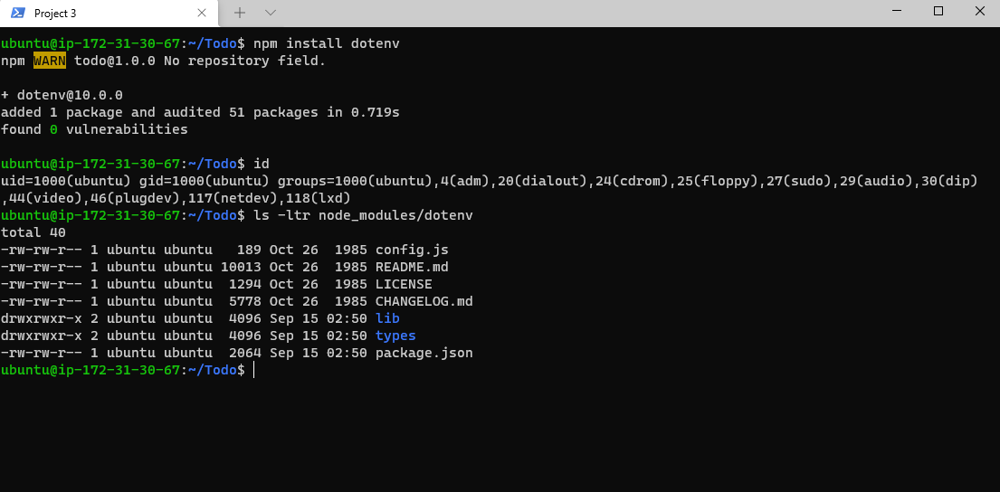

### Open the index.js file with the command below ###
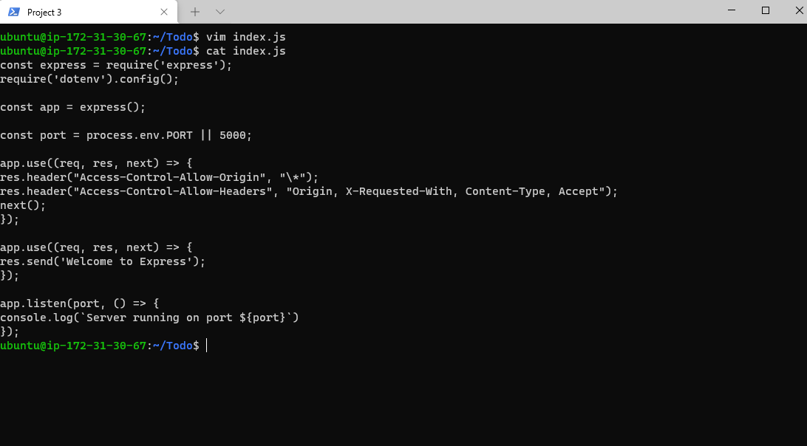

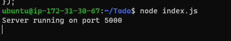

## created an inbound rule to open TCP port 80, you need to do the same for port 5000, like this ##

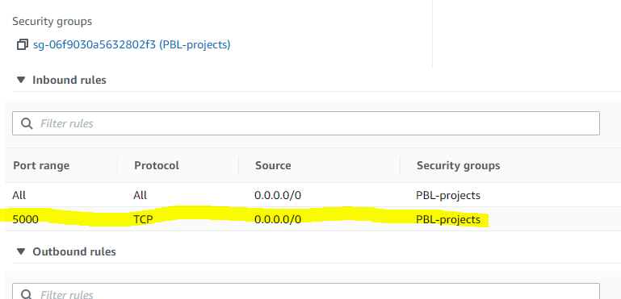

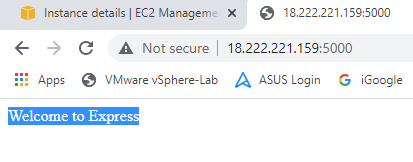

# Routes #

## mkdir routes ##

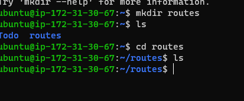

## create a file api.js ##

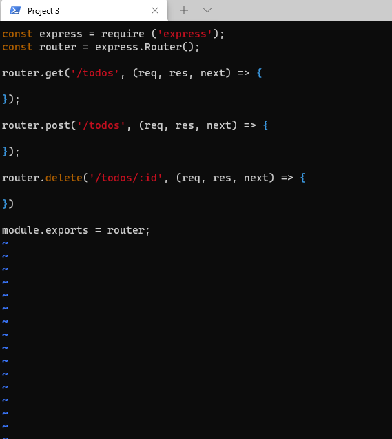

# MODELS #

## Mongoose ##

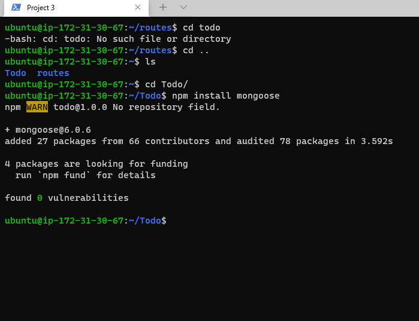

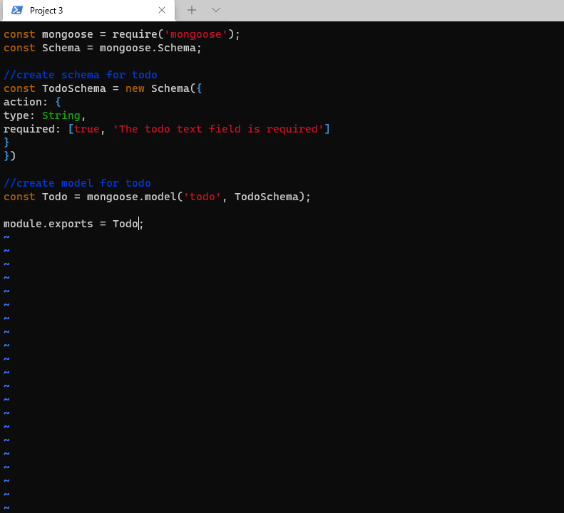

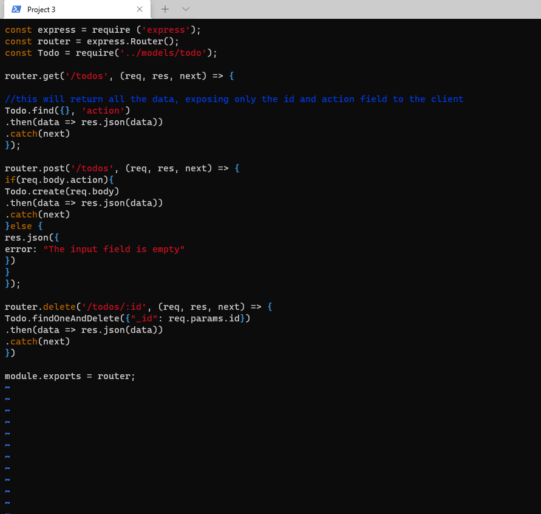

# MONGODB DATABASE #

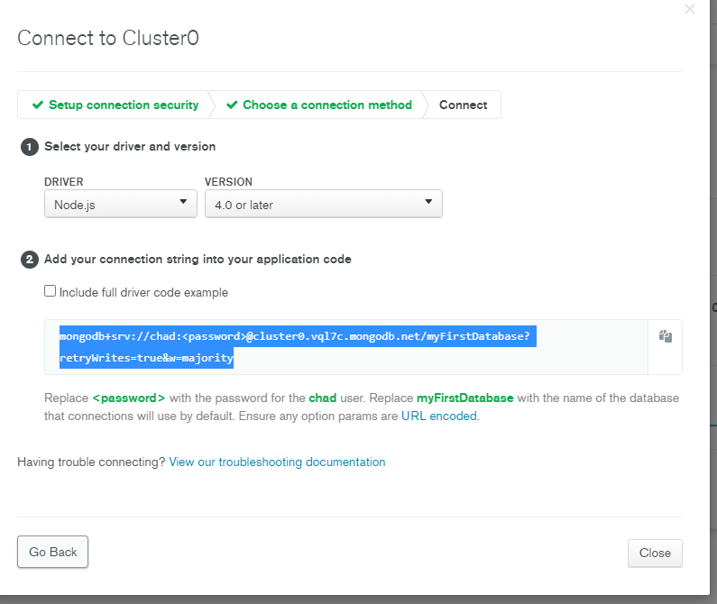

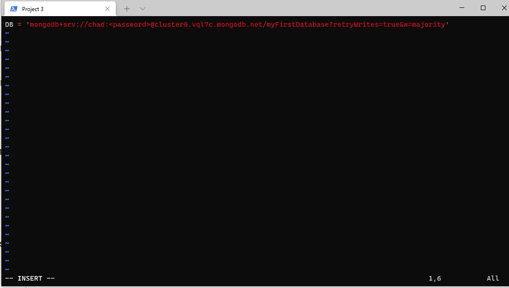